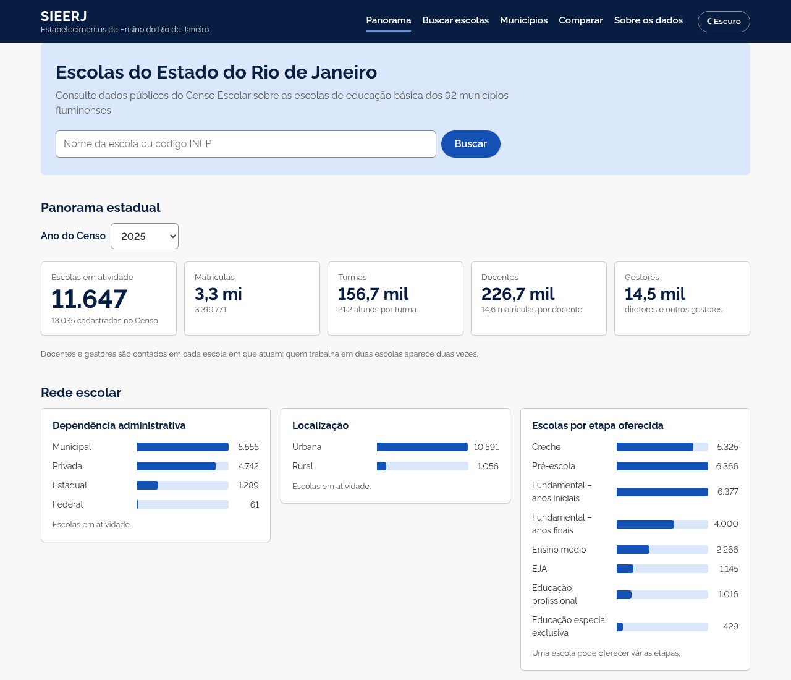
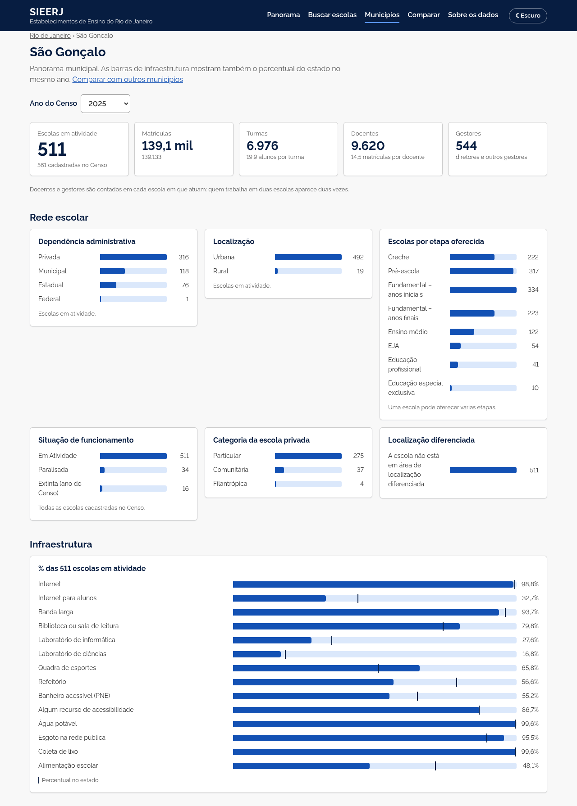
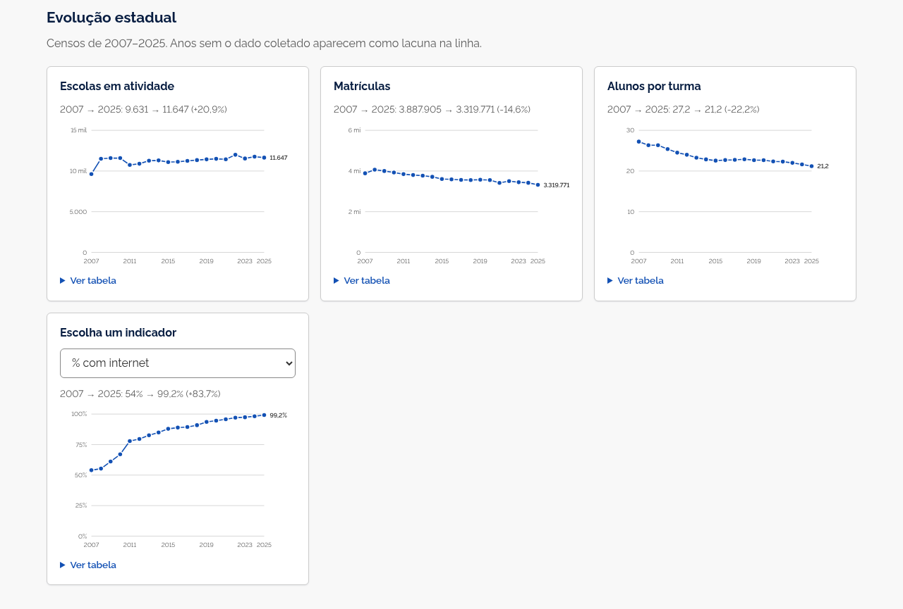
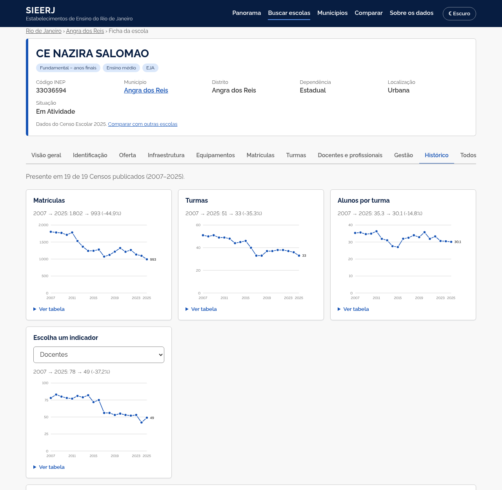
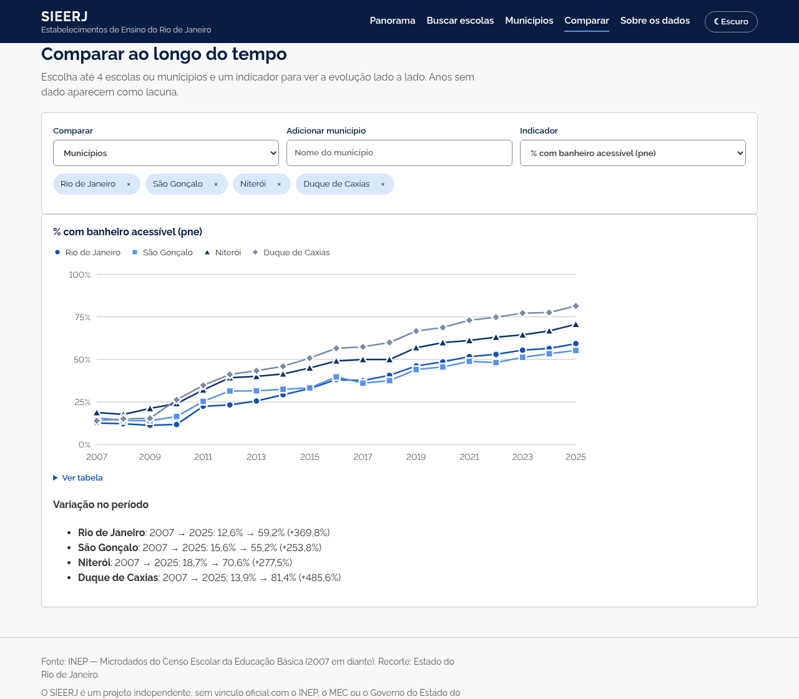
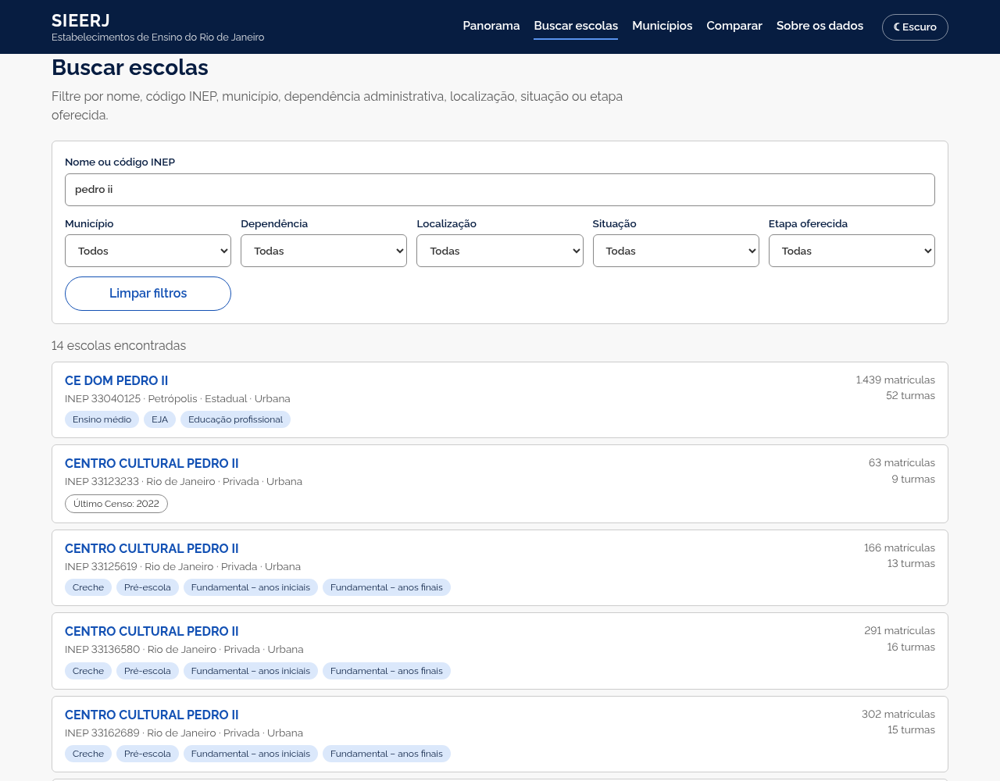
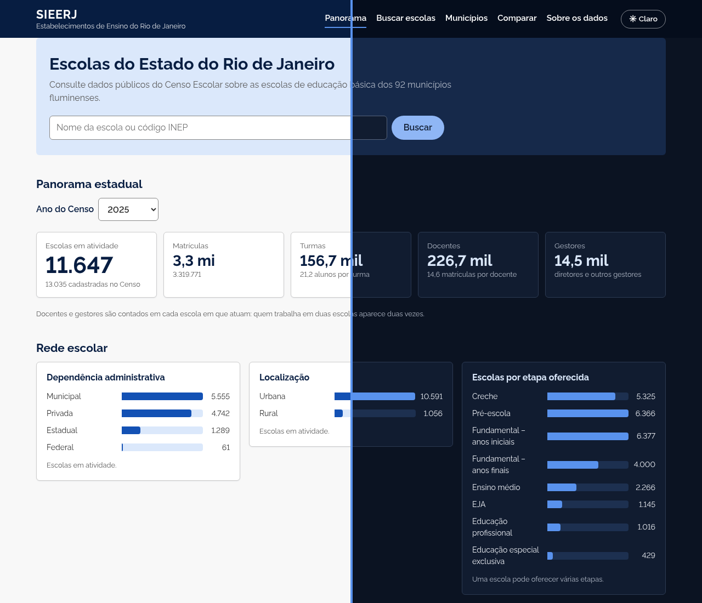
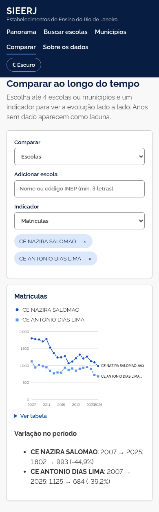
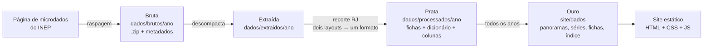

# SIEERJ — Sistema de Informações dos Estabelecimentos de Ensino do Rio de Janeiro

Plataforma aberta para explorar os dados públicos das escolas de educação básica do Estado do Rio de Janeiro, construída a partir dos microdados do **Censo Escolar (INEP)** de **2007 a 2025**.




---

## Sumário

- [Sobre o projeto](#sobre-o-projeto)
- [O que o site oferece](#o-que-o-site-oferece)
- [Como executar localmente](#como-executar-localmente)
- [Arquitetura](#arquitetura)
- [Decisões técnicas](#decisões-técnicas)
- [Testes](#testes)
- [Estrutura do repositório](#estrutura-do-repositório)
- [Publicar na internet](#publicar-na-internet)
- [Limitações conhecidas](#limitações-conhecidas)
- [Roteiro](#roteiro)
- [Fonte dos dados](#fonte-dos-dados)
- [Autoria e licença](#autoria-e-licença)

---

## Sobre o projeto

Os microdados do Censo Escolar são públicos, mas chegam em arquivos grandes (centenas de megabytes por ano), com variáveis codificadas e formatos que mudam ao longo do tempo. Na prática, só quem trabalha com análise de dados consegue usá-los.

O **SIEERJ** transforma esses arquivos num site simples, em que qualquer pessoa pode:

- encontrar uma escola por nome, código INEP ou município;
- consultar uma **ficha** organizada por temas (identificação, infraestrutura, matrículas, turmas, docentes…), no modelo do [CNES](https://cnes.datasus.gov.br/);
- acompanhar a **evolução** de escolas, municípios e do estado ao longo de **19 Censos**;
- **comparar** até quatro escolas ou municípios no mesmo gráfico.

**Público:** famílias, estudantes, profissionais da educação, gestão pública, jornalistas e pesquisadores.

| Em números | |
|---|---|
| Censos processados | 19 (2007–2025) |
| Escolas com ficha | 17.777 (inclusive as já extintas) |
| Municípios | 92 |
| Variáveis descritas | ~1.080, com rótulos do dicionário oficial do INEP |

---

## O que o site oferece

### Panorama estadual e municipal, por ano

Escolas em atividade, matrículas, turmas, docentes e gestores; composição da rede; percentual de escolas com cada item de infraestrutura; matrículas por etapa, turno, cor/raça, sexo, idade e zona de residência; perfil dos docentes; cursos técnicos com mais matrículas. Um seletor troca o ano do Censo. Na página do município, as barras de infraestrutura mostram também o percentual do estado.



### Evolução histórica

Séries de 2007 a 2025 para o estado, cada município e cada escola. Anos em que uma variável não foi coletada aparecem como **lacuna** na linha, nunca como zero.



### Ficha da escola

Cabeçalho com os dados principais, comparação escola × município × estado (alunos por turma, matrículas por docente) e abas temáticas. A aba **Histórico** mostra a evolução da escola e uma grade de infraestrutura ano a ano. Escolas extintas continuam consultáveis, com a ficha do último Censo em que aparecem.



### Comparar

Até quatro escolas ou municípios no mesmo gráfico, com escolha do indicador e a variação no período. Cada série tem forma de marcador própria, rótulo e tabela: a identificação não depende só da cor.



### Busca

Por nome ou código INEP, com filtros de município, dependência administrativa, localização, situação e etapa. Os filtros ficam na URL, então uma busca pode ser compartilhada por link.



### Tema claro e escuro, e celular

Botão no cabeçalho alterna o tema (a escolha fica salva no navegador; sem escolha, segue o sistema). O layout funciona em telas de celular.

| Claro × escuro | Celular |
|---|---|
|  |  |

---

## Como executar localmente

### 1. Pré-requisitos

| Ferramenta | Versão | Para quê |
|---|---|---|
| Python | 3.10 ou superior (testado com 3.12 e 3.14) | pipeline de dados e servidor local |
| GNU Make | qualquer | atalhos (`make dados`, `make servir`…) — opcional |
| Node.js | 20 ou superior | **apenas** para rodar os testes do site |
| Git | qualquer | clonar o repositório |

Não há dependências para instalar: o pipeline usa só a biblioteca padrão do Python e o site é HTML, CSS e JavaScript puros.

Recursos na primeira execução: conexão com a internet (download de ~1 GB do INEP) e **~6 GB livres** em disco.

### 2. Clonar

```sh
git clone https://github.com/ifLauraAlmeida/sieerj.git
cd sieerj
```

### 3. Gerar os dados

```sh
make dados
```

O comando raspa a página de microdados do INEP, baixa os arquivos de 2007 a 2025, descompacta, extrai o recorte do Rio de Janeiro e gera os arquivos do site em `site/dados/`. Na primeira vez leva de 10 a 20 minutos, conforme a internet; nas seguintes, reaproveita o que já foi baixado e processado (cerca de 2 minutos).

Para processar só alguns anos:

```sh
make dados ANOS=2019-2025
```

### 4. Abrir o site

```sh
make servir
```

Acesse **<http://localhost:8000>**. Para encerrar, `Ctrl+C` no terminal.

> O site precisa de um servidor local: abrir o `index.html` direto do disco (`file://`) não funciona, porque o navegador bloqueia a leitura dos arquivos de dados nesse modo.

### Sem `make` (por exemplo, no Windows sem WSL)

```sh
python -m pipeline tudo --anos 2007-2025
python -m http.server 8000 --directory site
```

### Etapas do pipeline separadas

```sh
python3 -m pipeline coletar   --anos 2024   # camada bruta: raspa a página do INEP e baixa o .zip
python3 -m pipeline extrair   --anos 2024   # camada extraída: descompacta
python3 -m pipeline processar --anos 2024   # camada prata: recorte RJ normalizado
python3 -m pipeline publicar                # camada ouro: arquivos do site com todos os anos processados
```

| Comando | O que faz |
|---|---|
| `make dados` | todas as camadas para `ANOS` (padrão 2007–2025) |
| `make dados-forcar` | idem, reprocessando a camada prata mesmo se já existir |
| `make publicar-dados` | refaz só `site/dados/` a partir do que já foi processado |
| `make servir` | servidor local em <http://localhost:8000> |
| `make test` | testes do pipeline e do site |
| `make pacote` | gera `dist/site` pronto para hospedagem |

---

## Arquitetura



| Camada | Pasta | Conteúdo |
|---|---|---|
| Bruta | `dados/brutos/<ano>/` | `.zip` original do INEP + `metadados.json` (URL, tamanho, SHA-256, data do download) |
| Extraída | `dados/extraidos/<ano>/` | conteúdo do zip, intacto |
| Prata | `dados/processados/<ano>/` | `fichas.jsonl.gz` (uma ficha por escola do RJ), `dicionario.json`, `meta.json` (layout e colunas coletadas no ano) |
| Ouro | `site/dados/` | `anos.json`, `panoramas/<ano>.json`, `series.json`, `escolas/<lote>.json`, `indice.json`, `dicionario.json`, `indicadores.json` |

Cada camada é idempotente: o que já existe é reaproveitado, e uma execução interrompida é retomada de onde parou.

**Pipeline (`pipeline/`)** — módulos pequenos, com o acesso a disco e à rede isolado atrás de interfaces (`SistemaArquivos`, `ClienteHttp`), o que permite testar tudo com implementações falsas em memória. Logs em JSON estruturado.

**Site (`site/`)** — páginas estáticas com módulos JavaScript sem bibliotecas externas. Gráficos em SVG próprios, com dica ao passar o mouse, navegação por teclado e tabela equivalente em cada gráfico.

---

## Decisões técnicas

- **Dois layouts, um formato.** De 2007 a 2024 o INEP publica um CSV único por ano, já harmonizado; em 2025, seis tabelas separadas. A camada prata converte os dois para a mesma ficha por escola.
- **Zero × não coletado.** Nos anos republicados, o INEP preenche com `0` variáveis que ainda não existiam (por exemplo, internet para alunos antes de 2019). O pipeline lê, no dicionário de cada ano, a matriz "Coleta por ano" e trata essas variáveis como ausentes. Nas séries elas viram lacuna, não "0%".
- **Totais oficiais.** Matrículas usam `QT_MAT_BAS`, o total da educação básica calculado pelo INEP. Somar etapas contaria duas vezes quem está, por exemplo, no ensino médio integrado ao técnico.
- **Rótulos do dicionário oficial.** Descrições e categorias vêm do dicionário `.xlsx` de cada ano, lido com a biblioteca padrão (o `.xlsx` é um zip de XMLs).
- **TLS do INEP sem atalhos.** O servidor de download do INEP não envia o certificado intermediário. Em vez de desligar a verificação, o pipeline baixa o intermediário pelo endereço indicado no próprio certificado e confere seu SHA-256, fixado no código.
- **Arquivos agrupados em lotes.** As fichas ficam em 256 arquivos (≈70 escolas cada) em vez de 17 mil arquivos avulsos, o que torna o envio para hospedagens estáticas rápido. O site calcula o lote pelo código INEP.
- **Acessibilidade.** Contraste conforme WCAG AA, navegação por teclado (inclusive nos gráficos e abas), marcação semântica e identidade das séries que não depende só da cor.

---

## Testes

```sh
make test
```

- **Pipeline:** `python3 -m unittest discover -s tests/pipeline -t .` — 79 testes, com sistema de arquivos e cliente HTTP falsos (sem rede e sem disco).
- **Site:** `node --test "tests/site/*.test.js"` — 54 testes das regras de busca, séries, formatação, comparação e gráficos.

---

## Estrutura do repositório

```
sieerj/
├── pipeline/                # Python: coleta, extração, prata e ouro
│   ├── __main__.py          # linha de comando (coletar, extrair, processar, publicar, tudo)
│   ├── coleta.py            # raspagem da página do INEP e download
│   ├── cliente_http.py      # HTTP com novas tentativas e ajuste de TLS do INEP
│   ├── extracao.py          # descompactação
│   ├── formatos.py          # detecção do layout de cada ano
│   ├── arquivo_unico.py     # layout 2007–2024
│   ├── tabelas.py           # layout 2025
│   ├── dicionario.py        # leitura do dicionário .xlsx
│   ├── prata.py             # camada prata
│   ├── publicacao.py        # camada ouro
│   ├── panorama.py, series.py, indicadores.py, …
├── site/
│   ├── index.html           # panorama estadual, evolução e municípios
│   ├── escolas.html         # busca
│   ├── escola.html          # ficha da escola
│   ├── municipio.html       # panorama municipal
│   ├── comparar.html        # comparação ao longo do tempo
│   ├── css/estilo.css
│   └── js/                  # módulos ES (um por responsabilidade)
├── tests/
│   ├── pipeline/            # unittest
│   └── site/                # node --test
├── docs/imagens/            # capturas usadas neste README
├── .github/workflows/       # publicação opcional no GitHub Pages
├── Makefile
├── AUTORIA.md
└── LICENSE.md
```

Não são versionados (ver `.gitignore`): `dados/` (camadas do pipeline, ~5 GB), `site/dados/` (gerado, ~150 MB) e `dist/`.

---

## Publicar na internet

O site é estático: basta hospedar a pasta `site/` **com** `site/dados/`. Nenhuma das opções abaixo exige domínio pago.

**Netlify ou Cloudflare Pages (mais simples)**

1. `make dados && make pacote`
2. Envie a pasta `dist/site` em <https://app.netlify.com/drop> (ou em Cloudflare Pages → *Upload assets*).
3. O site fica em `https://<nome>.netlify.app` (ou `.pages.dev`). Para atualizar, repita o envio.

**GitHub Pages**

1. `make dados && make pacote`
2. Crie um release com a tag `dados-2025` e anexe `dist/sieerj-dados.zip`.
3. Em *Settings → Pages*, escolha *Source: GitHub Actions*.
4. Em *Actions → Publicar site → Run workflow*. O site fica em `https://<usuário>.github.io/sieerj/`.

O pipeline roda só na sua máquina: quem acessa o site baixa apenas os arquivos prontos da página que abriu. Rodar de novo só é necessário quando o INEP publicar um novo Censo (`make dados ANOS=2026`).

---

## Limitações conhecidas

- **Anos anteriores a 2007** usam um layout legado do INEP e ainda não são processados.
- **Docentes e gestores** são contados por escola: quem atua em duas escolas conta duas vezes (é assim que o INEP publica os totais por escola).
- **Gestores** só existem nos microdados a partir de 2025.
- **Endereço** não é exibido: não consta dos microdados de 2025.
- O site mostra dados de estabelecimentos e agregados; os microdados já são anonimizados pelo INEP.

---

## Roteiro

- [x] Pipeline em camadas com coleta automática no site do INEP
- [x] Censos de 2007 a 2025, com tratamento de variáveis não coletadas
- [x] Panorama estadual e municipal por ano
- [x] Ficha da escola com abas temáticas e histórico
- [x] Busca com filtros e comparação entre escolas e municípios
- [x] Tema claro e escuro; layout para celular
- [ ] Anos anteriores a 2007 (layout legado)
- [ ] Mapa das escolas
- [ ] Indicadores de rendimento e IDEB (outras bases do INEP)

---

## Fonte dos dados

**Microdados do Censo Escolar da Educação Básica — INEP**
<https://www.gov.br/inep/pt-br/acesso-a-informacao/dados-abertos/microdados/censo-escolar>

> INEP — Instituto Nacional de Estudos e Pesquisas Educacionais Anísio Teixeira. *Microdados do Censo Escolar da Educação Básica.* Brasília: INEP.

O SIEERJ é um projeto independente e **não possui vínculo oficial** com o INEP, o Ministério da Educação ou o Governo do Estado do Rio de Janeiro.

---

## Autoria e licença

Desenvolvido por **Laura Almeida** ([@ifLauraAlmeida](https://github.com/ifLauraAlmeida)). Detalhes e forma de citação em [AUTORIA.md](AUTORIA.md).

© 2026 Laura Almeida. **Todos os direitos reservados.** O código pode ser lido e executado localmente para estudo; cópia, redistribuição, obras derivadas e uso comercial dependem de autorização da autora. Condições completas em [LICENSE.md](LICENSE.md).
